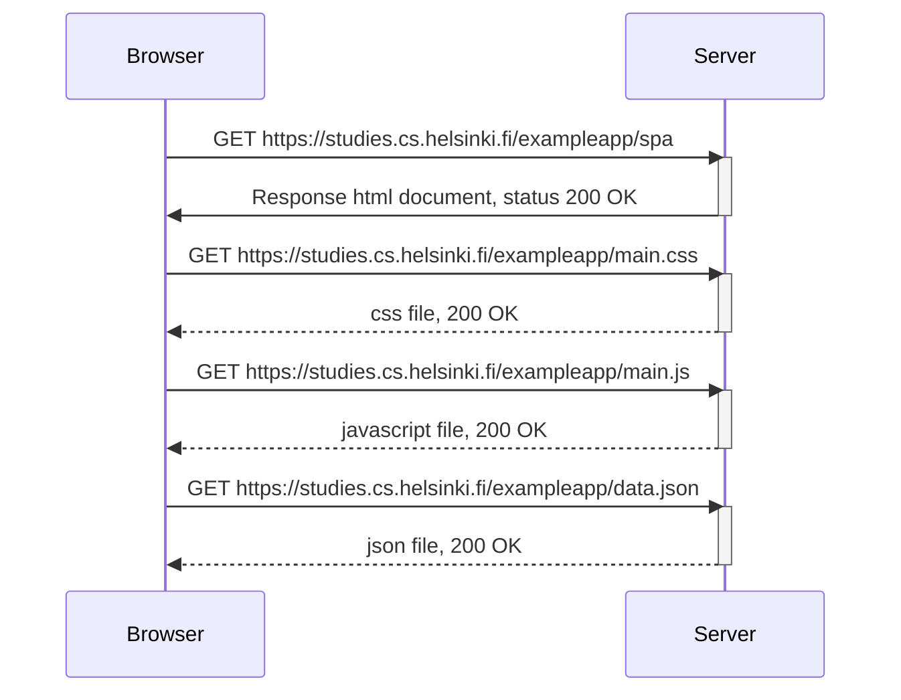

```mermaid
    sequenceDiagram
        participant Browser
        participant Server
        Browser->>Server: GET https://studies.cs.helsinki.fi/exampleapp/spa
        activate Server
        Server->>Browser: Response html document, status 200 OK 
        deactivate Server
        Browser->>Server: GET https://studies.cs.helsinki.fi/exampleapp/main.css
        activate Server
        Server-->>Browser: css file, 200 OK
        deactivate Server
        Browser->>Server: GET https://studies.cs.helsinki.fi/exampleapp/main.js
        activate Server
        Server-->>Browser: javascript file, 200 OK
        deactivate Server
        Browser->>Server: GET https://studies.cs.helsinki.fi/exampleapp/data.json
        activate Server
        Server-->>Browser: json file, 200 OK
        deactivate Server
```